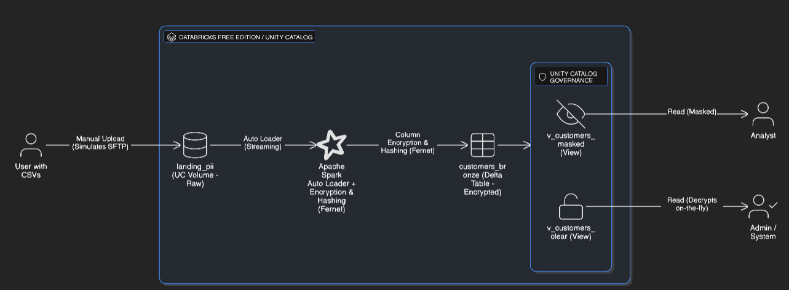

# Secure PII ingestion with Databricks Free Edition

This repo shows a small, end-to-end example of how to ingest PII (Personally Identifiable Information) on **Databricks Free Edition** using:

- Unity Catalog + **Volumes** as storage
- **Auto Loader** to ingest CSV files
- Simple **column-level encryption and hashing** in PySpark
- Two SQL views: **clear** vs **masked** data

> **Disclaimer** > This is an educational PoC on Databricks Free Edition.  
> Do **not** use this project as-is for real production PII.


---

## 1. What you build

We use:

- Catalog: `workspace`
- Schema: `pii_demo`
- Volumes:
  - `landing_pii`     → RAW files (simulated SFTP drop zone)
  - `bronze_pii`      → encrypted Delta files
  - `checkpoints_pii` → Auto Loader checkpoints

**Data flow:**

1. You upload CSV files with PII into the `landing_pii` volume.
2. An Auto Loader streaming job reads from `landing_pii`.
3. The job applies a PII policy:
   - encrypts selected columns (`full_name`, `email`, `phone`)
   - hashes `national_id`
4. The job writes **encrypted Delta** files into `bronze_pii`.
5. Unity Catalog exposes:
   - table `customers_bronze`
   - view `v_customers_clear`   (decrypts PII – for privileged users)
   - view `v_customers_masked`  (masked PII – for normal analysts)

---

## 2. Quickstart (Free Edition)

### Step 1 – Create schema and volumes

Open `notebooks/00_setup_uc_and_volumes.py` in Databricks and **Run all**.

This will:
- use catalog `workspace`
- create schema `pii_demo`
- create Volumes: `landing_pii`, `bronze_pii`, `checkpoints_pii`

### Step 2 – Upload a sample CSV

In Databricks:  
`Data → workspace → pii_demo → Volumes → landing_pii → Upload`

Example CSV:

```csv
customer_id,full_name,email,phone,national_id,city
1,Ana Gomez,ana.gomez@example.com,+34-600000001,11111111A,Malaga
2,Luis Perez,luis.perez@example.com,+34-600000002,22222222B,Madrid
3,Maria Lopez,maria.lopez@example.com,+34-600000003,33333333C,Sevilla
```

### Step 3 – Run the Auto Loader + encryption notebook

Open `notebooks/01_autoloader_encrypt_pii.py` and:

1. **Generate a Fernet key once** (for example in a small Python cell):

   ```python
   from cryptography.fernet import Fernet
   print(Fernet.generate_key().decode("utf-8"))
   ```

2. Copy the printed value and paste it into the `ENCRYPTION_KEY` variable inside the notebook.
3. Run the `%pip install` cell once.
4. **Run all cells** to start the Auto Loader stream.

*Auto Loader will read from `landing_pii` and write encrypted Delta rows into `bronze_pii`.*

### Step 4 – Query the tables and views

From a SQL notebook or the SQL editor:

```sql
USE CATALOG workspace;
USE pii_demo;

SELECT * FROM customers_bronze;
SELECT * FROM v_customers_clear;
SELECT * FROM v_customers_masked;
```

You should see:
- **encrypted base64 strings** in `customers_bronze` for full_name, email, phone.
- **clear PII** in `v_customers_clear`.
- **masked PII** in `v_customers_masked`.

---

## 3. Going further (enterprise ideas)

This project is Free Edition-friendly on purpose. In a real enterprise deployment you would usually:

1. **Store data in external locations** on ADLS/S3 (landing/bronze/silver/gold) with private networking and customer-managed keys.
2. **Store encryption keys in Key Vault / KMS**, and read them with `dbutils.secrets.get(...)` instead of hard-coding them.
3. **Use Unity Catalog for governance**:
   - catalogs per domain.
   - grants to groups (e.g. `pii_admins`, `analysts`).
   - optional row/column-level security and dynamic masking.


---

## 4. Limitations and security model

This project is an educational PoC, not a production-ready security design.
- **No real SFTP here:** `landing_pii` just simulates a secure file drop zone.

### 4.1 Plain text in memory

Risk:
- Auto Loader reads the CSV as clear text.
- The PII policy runs on clear text before encryption.
- The `v_customers_clear` view decrypts data again at query time.

Good practice:
- Treat the compute that runs this job as a **sensitive environment**.
- Avoid `display()` or ad-hoc exports of raw PII during development.
- Use **short-lived jobs** instead of long-running interactive clusters.

Enterprise path:
- Run on dedicated, private compute (no shared workspaces).
- Use network isolation and endpoint policies to limit where jobs can talk to.

### 4.2 Access to the landing zone

Risk:
- Files in `landing_pii` are stored in clear text.
- Anyone with read access to the volume can see raw PII.

Good practice:
- Keep the landing zone **small and short-lived**:
  - only ingestion jobs can write there,
  - only the encryption job can read from there.
- Delete or archive files after successful encryption.

Enterprise path:
- Use a dedicated **landing container** in ADLS/S3.
- Protect it with private networking and tight ACLs.
- Apply automatic retention and lifecycle policies.

### 4.3 Access to notebooks and clear views

Risk:
- Anyone who can run the notebook or query `v_customers_clear`
  can see decrypted PII.

Good practice:
- Use the **masked view** (`v_customers_masked`) as the default interface.
- Limit who can run the encryption notebook.
- Never mix PII notebooks with general analytics notebooks.

Enterprise path:
- Use Unity Catalog grants to separate:
  - admins who can see clear views,
  - analysts who can only see masked views.
- Optionally hide decryption behind service principals and audited endpoints.

### 4.4 Key management

Risk:
- In this PoC the Fernet key is hard-coded in the notebook.
- Anyone with notebook access can see and copy the key.

Good practice:
- Even in a lab, treat the key as **sensitive configuration**.
- Do not commit real keys to Git.
- If you rotate the key, be explicit about what data can still be read.

Enterprise path:
- Store keys in a secret manager (Key Vault, KMS, etc.).
- Read them via `dbutils.secrets.get(...)`.
- Implement rotation and audit on key access.

### 4.5 Databricks Free Edition constraints

Risk:
- Free Edition runs entirely on Databricks-managed infrastructure.
- You cannot configure your own cloud account, network, or customer-managed keys.
- It is not intended for real production PII.

Good practice:
- Use this project only for **synthetic / test data**.
- Use it to understand patterns, not to host real customer data.

Enterprise path:
- Move the pattern to a full Databricks workspace in your own cloud account.
- Use:
  - external locations on ADLS/S3,
  - private networking (VNet / VPC / Private Link),
  - customer-managed keys,
  - full Unity Catalog governance and logging.


## 5. Official documentation links
- Databricks Free Edition: Managed storage, quotas, security limitations:
https://docs.databricks.com/aws/en/getting-started/free-edition-limitations

- Unity Catalog & Volumes:
Data governance, controlled storage zones:
https://docs.databricks.com/aws/en/sql/language-manual/sql-ref-volumes

- Auto Loader:
Incremental streaming ingestion, availableNow trigger
https://docs.databricks.com/aws/en/ingestion/cloud-object-storage/auto-loader

- Column-level encryption (Fernet, Python):
Python cryptography, Fernet key usage
https://cryptography.io/en/latest/fernet/
Example in Databricks:
https://www.linkedin.com/posts/selvamkasi_column-level-encryption-in-databricks-using-activity-7373300937303580672-XVGQ/

- Access controls, masking & views:
Masking in SQL, role separation using views:
https://learn.microsoft.com/en-us/azure/databricks/views/dynamic | 
https://docs.plainid.io/docs/databricks-column-level-access | 
https://hoop.dev/blog/pii-catalog-and-data-masking-in-databricks-a-practical-guide/

- Security model & best practices:
Governance, recommended controls, enterprise migration:
https://learn.microsoft.com/en-us/azure/databricks/data-governance/unity-catalog/best-practices
